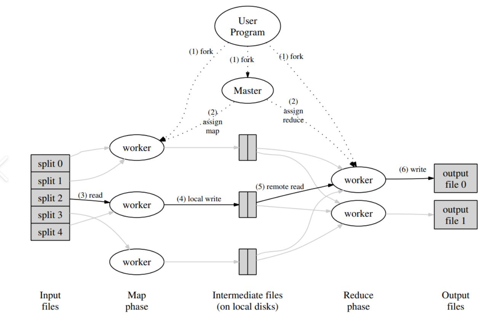

# Implementing MapReduce Algorithm in Rust


## Overview

This project implements a simple MapReduce algorithm in Rust. It reads a set of strings and counts the occurrences of each word, demonstrating basic parallel processing using threads.


## Features

- **MapReduce Implementation**: Efficiently processes data using the MapReduce paradigm.
- **Multithreading**: Utilizes Rust's threading capabilities for concurrent execution.
- **Word Count**: Counts the frequency of words in the input strings.

## Requirements

- Rust .11 or higher
- Cargo (Rust package manager) 1.81.0

## Getting Started

### Installation

1. Clone the repository:
   ```bash
   git clone https://github.com/your-username/your-repo-name.git
   cd your-repo-name
   ```

2. Build the project:
   ```bash
   cargo build
   ```

3. Run the project:
   ```bash
   cargo run
   ```

### Usage

Modify the `input` vector in `main.rs` with your own strings to perform a word count.

## Example Output

```
hello: 3
world: 1
rust: 2
map: 1
reduce: 1
is: 1
great: 1
```

## Contributing

If you would like to contribute to this project, please fork the repository and submit a pull request.

## License

This project is licensed under the MIT License - see the [LICENSE](LICENSE) file for details.

## Acknowledgments

- Inspired by the MapReduce paradigm.
- Thanks to the Rust community for their support and resources.

```

Feel free to modify any sections as needed to better fit your project!